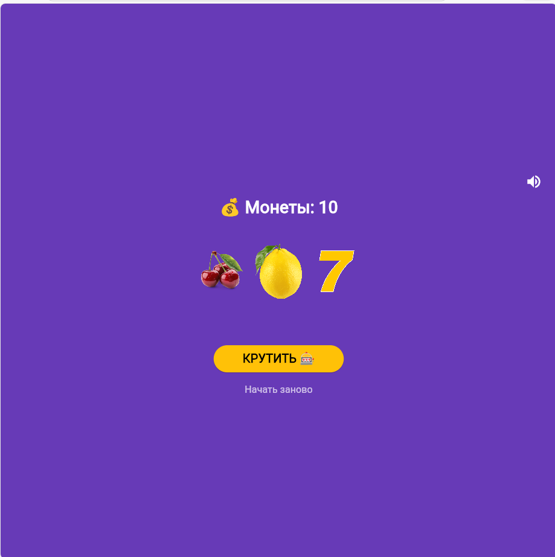
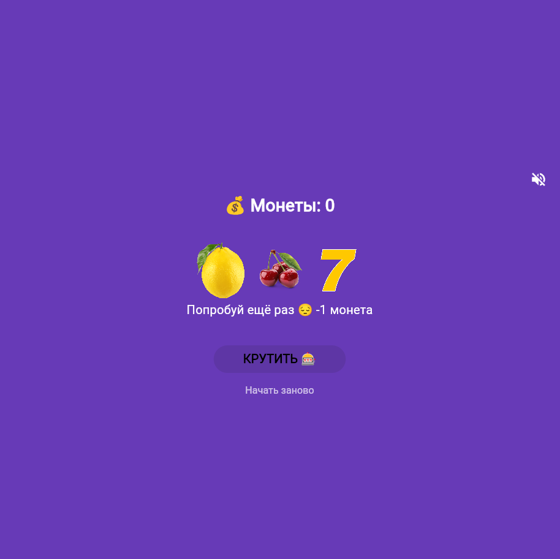

# Учебное приложение. 🎰 Слот-машина 

Простое Flutter-приложение - симулятор казино. Крути барабаны, собирай одинаковые сиволы и выигрывай монеты!

## 📱Скриншоты
|Главный экран|Победа|Монеты закончились|
|:----:|:-----:|:----:|
||||
---

## Как играть

- Нажмите **КРУТИТЬ** чтобы запустить барабаны
- Три одинаковых символа — победа (+3 монеты)
- Три семёрки — джекпот (+10 монет)
- Разные символы — проигрыш (-1 монета)
- Начните заново кнопкой **Начать заново**

---
## 🚀 Запуск проекта

**Требования:** Flutter 3.x, Dart 3.x

```bash
# Клонировать репозиторий
git clonehttps://github.com/okolodk/Flutter_Lab6

# Перейти в папку
cd slot_machine

# Установить зависимости
flutter pub get

# Запустить в Chrome
flutter run -d chrome
```
---
## ⚙️ Технологии
- Flutter 3.41.2
- Dart 3.11.0
- Платформы: Web, Android
 
 ---
## 📚 Что изучено
- StatefulWidget и управление состоянием  через setState()
- Работа с локальными изображениями - через Image.asset()
- Генерация случайных чисел через dart:math
- Анимация через async/await и AnimatedOpacity
- Создание иконки в Krita и подключение через flutter_launcher_icons
- Сборка под Web и Android
- Работа со звуком:
--Web Audio API (для браузера)
--Пакет audioplayers (кроссплатформенное решение)

## 👤 Автор
Григорий Алексеев — группа ИСП-233
Лабораторная работа №6, 2026